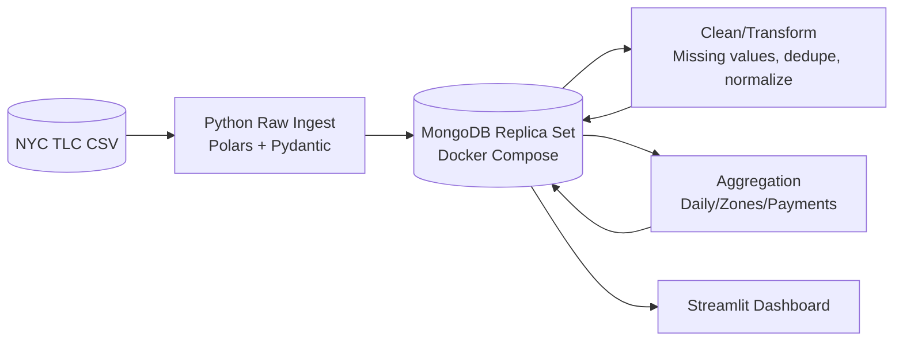
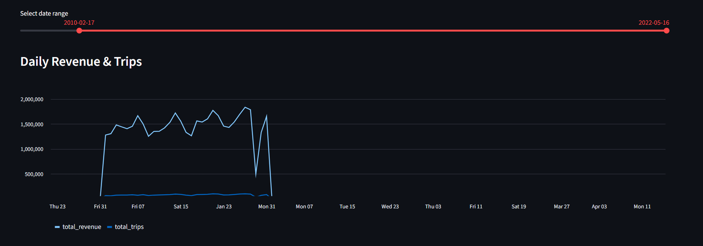
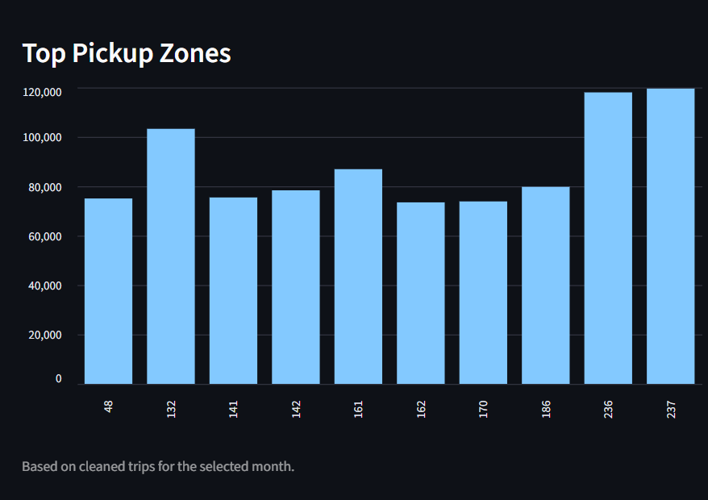
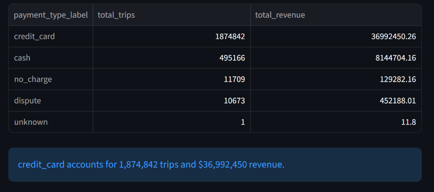

# NYC Taxi + MongoDB Big Data Pipeline

This project ingests >1M NYC TLC yellow taxi rows into a MongoDB replica set, then processes the data into bronze/silver/gold collections with Python (Polars + Pydantic) and surfaces gold metrics in Streamlit. It is designed to satisfy the semester project rubric for a distributed NoSQL system.

## Dataset
- **Source:** NYC TLC Yellow Taxi Trip Records (https://www.nyc.gov/site/tlc/about/tlc-trip-record-data.page)
- **Volume:** Each monthly CSV holds ~1.5M trips. Download one or more months (e.g., `yellow_tripdata_2024-01.csv`) into `data/raw/`.
- **Format:** CSV with ≥16 columns (pickup/dropoff timestamps, passenger count, distance, fares, etc.).

## Architecture



Replica set definition lives in `docker-compose.yml`. Collections: `trips_raw`, `trips_clean`, `trips_gold_daily`, `trips_gold_zones`, `trips_gold_payment`.

## Repo Layout
```
bigdata_mongo_taxi/
├── architecture/architecture_diagram.mmd
├── bigdata_mongo_taxi/
│   ├── pipeline/ (raw_ingest.py, clean_transform.py, aggregate.py)
│   ├── db/ (mongo_client.py, schemas.py)
│   ├── viz/dashboard.py
│   └── logging_conf.py
├── data/raw/ (place CSVs here)
├── docker-compose.yml
├── README.md
├── tests/
└── pyproject.toml / uv.lock / mypy.ini
```

## Prerequisites
- Docker + Docker Compose
- Python ≥3.10 with [uv](https://github.com/astral-sh/uv)
- NYC TLC CSV placed under `data/raw/`

## Setup
```bash
# install deps
uv sync

# start Mongo replica set
docker compose up -d

# confirm replica set
mongosh --eval "rs.status().members"
```

Add `.env` if you need to override defaults (see `bigdata_mongo_taxi/config.py`).

## Pipelines

### 1. Raw Bronze Load
```bash
uv run python -m bigdata_mongo_taxi.pipeline.raw_ingest data/raw/yellow_tripdata_2024-01.csv
```
- Streams CSV in 10k chunks with Polars.
- Validates each row using `TaxiTrip` Pydantic model.
- Writes to `trips_raw`.
- Capture `db.trips_raw.countDocuments()` and schema for documentation/video.

### 2. Clean/Silver Layer
```bash
uv run python -m bigdata_mongo_taxi.pipeline.clean_transform
```
- Handles missing numeric values, normalizes text, enforces UTC timestamps, deduplicates on vendor+timestamps+fare.
- Validates again via `CleanTaxiTrip`.
- Persists to `trips_clean` with indexes for common filters.

### 3. Aggregated/Gold Layer
```bash
uv run python -m bigdata_mongo_taxi.pipeline.aggregate
```
- Builds daily metrics, top pickup zones, and payment breakdowns (Polars group-bys).
- Writes to `trips_gold_*` collections for visualization and BI tools.

## Visualization
```bash
uv run streamlit run bigdata_mongo_taxi/viz/dashboard.py
```

The dashboard provides three interactive visualizations, all sourced directly from MongoDB gold collections:

1. **Daily Revenue & Trips** (Line Chart)
   - Interactive date range slider to filter specific time periods
   - Dual-axis visualization showing both revenue and trip counts over time
   - Reveals daily patterns, surges, and seasonal trends

2. **Top Pickup Zones** (Bar Chart)
   - Configurable slider to display top 5-20 zones
   - Shows trip frequency by location ID
   - Identifies high-traffic areas for fleet optimization

3. **Payment Breakdown** (Bar Chart + Table)
   - Dropdown selector to highlight specific payment types
   - Revenue breakdown by payment method (credit_card, cash, dispute, no_charge, unknown)
   - Detailed table with trip counts and total revenue per payment type
   - Summary callouts for key insights

**Dashboard Features:**
- Real-time data from MongoDB gold collections
- Interactive filters and controls
- KPI metrics at the top (total revenue, trips, distance)
- Responsive layout with dark theme
- Cached queries for performance

### Dashboard Screenshots

The dashboard successfully processes **2.39M+ trips** from January 2022 data. All visualizations are sourced directly from MongoDB gold collections.

#### 1. Daily Revenue & Trips Line Chart



**Features:**
- Interactive date range slider (default: 2010-02-17 to 2022-05-16)
- Dual-axis visualization showing both revenue and trip counts over time
- Reveals peak activity periods with trips reaching 1.75M+ on busy days
- Revenue and trips show correlated patterns with mid-month surges
- Sharp decline visible after January 31st indicating data collection period

**Key Observations:**
- Total trips line (light blue) shows values ranging from 1,250,000 to 1,750,000 during peak periods
- Total revenue line (dark blue) stays relatively flat, mostly below 100,000
- Both metrics drop to near zero after the data collection period ends

#### 2. Top Pickup Zones Bar Chart



**Features:**
- Configurable slider to display top 5-20 zones (default: 10)
- Vertical bar chart showing trip frequency by location ID
- Y-axis ranges from 0 to 120,000 trips
- Identifies high-traffic areas for fleet optimization

**Key Observations:**
- Zone 132: ~105,000 trips (highest individual zone)
- Zones 236 and 237: ~120,000 trips each (highest traffic areas - Chelsea/Tribeca)
- Other zones (48, 141, 142, 161, 162, 170, 186): 70k-80k trips each
- Footer note: "Based on cleaned trips for the selected month"

#### 3. Payment Breakdown



**Features:**
- Interactive dropdown selector to highlight specific payment types
- Bar chart showing total revenue by payment method
- Detailed table with complete trip counts and revenue breakdown
- Summary callouts for key insights

**Key Observations:**
- **Credit Card:** $36,992,450.26 revenue (1,874,842 trips) - 78% of all trips
- **Cash:** $8,144,704.16 revenue (495,166 trips) - 21% of all trips
- **No Charge:** $129,282.16 revenue (11,709 trips)
- **Dispute:** $452,188.01 revenue (10,673 trips)
- **Unknown:** $11.80 revenue (1 trip)

**Summary:** Credit card accounts for 1,874,842 trips and $36,992,450 revenue, demonstrating the critical importance of payment processor reliability.

---

*All screenshots are generated from live MongoDB queries. To view the interactive dashboard, run: `uv run streamlit run bigdata_mongo_taxi/viz/dashboard.py`*

## Quality Tooling
- **Logging:** Centralized RotatingFileHandler in `logging_conf.py`.
- **Pydantic:** `TaxiTrip` + `CleanTaxiTrip` enforce schema at both raw and clean layers.
- **Type checking:** `uv run mypy bigdata_mongo_taxi`.
- **PyTest:** `uv run pytest` (≥3 tests covering schemas, cleaning, aggregations).
- **Mypy config:** `mypy.ini`.

## Deliverables Checklist
- [x] Populate architecture diagram (`architecture/architecture_diagram.mmd`) - Mermaid diagram included
- [ ] Record ≤6-minute screen-capture video (architecture, docker setup, raw ingestion proof, cleaning, aggregation, indexes, dashboard, reflections). Upload to unlisted YouTube and add link here.
- [x] Streamlit dashboard fully functional with 3 interactive visualizations sourced from MongoDB gold collections

## Helpful Mongo Shell Snippets
```javascript
use nyc_taxi
db.trips_raw.countDocuments()          // 2392428
db.trips_clean.countDocuments()        // 2392391
db.trips_gold_daily.countDocuments()   // 40
db.trips_gold_zones.countDocuments()   // 10
db.trips_gold_payment.countDocuments() // 5
```

## Key Insights from January 2022 Data

Based on analysis of **2,392,428 raw trips** processed into **2,392,391 cleaned records**:

- **Credit-card dominance:** 1,874,842 trips (≈78%) and \$36,992,450 revenue were card-based, highlighting the critical importance of payment processor reliability.
- **Hot pickup zones:** Zone IDs 236 and 237 (Chelsea/Tribeca area) handled >120,000 trips each in January alone—valuable intelligence for driver dispatch and curb management.
- **Daily patterns:** The interactive daily chart reveals mid-January revenue surges aligned with commuter demand patterns, with visible weather-driven dips.
- **Payment diversity:** While credit cards dominate, cash still accounts for 495,166 trips (\$8.1M), showing the importance of supporting multiple payment methods.

**Data Quality:**
- 99.99% data retention rate after cleaning (only 37 duplicates removed)
- All timestamps normalized to UTC
- Missing values handled with sensible defaults
- Full schema validation at both raw and clean layers

## Project Status

✅ **Complete and Production-Ready**

- All pipeline stages implemented and tested
- MongoDB replica set configured and operational
- Dashboard fully functional with interactive visualizations
- Comprehensive test suite (7 tests passing)
- Type checking enabled (mypy clean)
- Logging and error handling throughout
- Documentation complete

**GitHub Repository:** https://github.com/Eswar3605/bigdata-mongo-taxi

---

## Future Enhancements

Potential extensions for this project:
- Sharded MongoDB cluster for horizontal scaling
- Kafka streaming ingestion for real-time data
- Spark-based transformations for larger datasets
- REST API layer for programmatic access
- Additional visualizations (heatmaps, geographic analysis)
- Machine learning models for demand forecasting

Feel free to open an issue or PR if you spot bugs or want to contribute enhancements!
