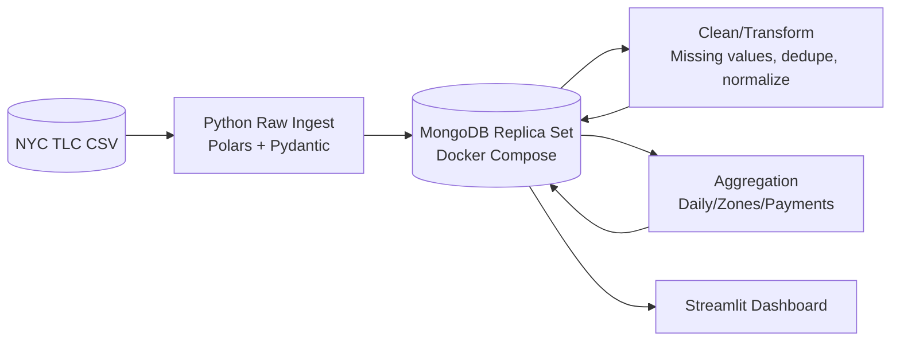

# NYC Taxi + MongoDB Big Data Pipeline

This project ingests >1M NYC TLC yellow taxi rows into a MongoDB replica set, then processes the data into bronze/silver/gold collections with Python (Polars + Pydantic) and surfaces gold metrics in Streamlit. It is designed to satisfy the semester project rubric for a distributed NoSQL system.

## Dataset
- **Source:** NYC TLC Yellow Taxi Trip Records (https://www.nyc.gov/site/tlc/about/tlc-trip-record-data.page)
- **Volume:** Each monthly CSV holds ~1.5M trips. Download one or more months (e.g., `yellow_tripdata_2024-01.csv`) into `data/raw/`.
- **Format:** CSV with ≥16 columns (pickup/dropoff timestamps, passenger count, distance, fares, etc.).

## Architecture



Replica set definition lives in `docker-compose.yml`. Collections: `trips_raw`, `trips_clean`, `trips_gold_daily`, `trips_gold_zones`, `trips_gold_payment`.

## Repo Layout
```
bigdata_mongo_taxi/
├── architecture/architecture_diagram.mmd
├── bigdata_mongo_taxi/
│   ├── pipeline/ (raw_ingest.py, clean_transform.py, aggregate.py)
│   ├── db/ (mongo_client.py, schemas.py)
│   ├── viz/dashboard.py
│   └── logging_conf.py
├── data/raw/ (place CSVs here)
├── docker-compose.yml
├── README.md
├── tests/
└── pyproject.toml / uv.lock / mypy.ini
```

## Prerequisites
- Docker + Docker Compose
- Python ≥3.10 with [uv](https://github.com/astral-sh/uv)
- NYC TLC CSV placed under `data/raw/`

## Setup
```bash
# install deps
uv sync

# start Mongo replica set
docker compose up -d

# confirm replica set
mongosh --eval "rs.status().members"
```

Add `.env` if you need to override defaults (see `bigdata_mongo_taxi/config.py`).

## Pipelines

### 1. Raw Bronze Load
```bash
uv run python -m bigdata_mongo_taxi.pipeline.raw_ingest data/raw/yellow_tripdata_2024-01.csv
```
- Streams CSV in 10k chunks with Polars.
- Validates each row using `TaxiTrip` Pydantic model.
- Writes to `trips_raw`.
- Capture `db.trips_raw.countDocuments()` and schema for documentation/video.

### 2. Clean/Silver Layer
```bash
uv run python -m bigdata_mongo_taxi.pipeline.clean_transform
```
- Handles missing numeric values, normalizes text, enforces UTC timestamps, deduplicates on vendor+timestamps+fare.
- Validates again via `CleanTaxiTrip`.
- Persists to `trips_clean` with indexes for common filters.

### 3. Aggregated/Gold Layer
```bash
uv run python -m bigdata_mongo_taxi.pipeline.aggregate
```
- Builds daily metrics, top pickup zones, and payment breakdowns (Polars group-bys).
- Writes to `trips_gold_*` collections for visualization and BI tools.

## Visualization
```bash
uv run streamlit run bigdata_mongo_taxi/viz/dashboard.py
```
Three required views (all sourced directly from Mongo gold collections):
1. Daily revenue vs. trip counts (line chart) – see `docs/screenshots/daily_metrics.png`.
2. Top pickup zones (bar chart) – see `docs/screenshots/top_zones.png`.
3. Payment method revenue split (bar + table) – see `docs/screenshots/payment_breakdown.png`.

Screenshots are stored under `docs/screenshots/` for reference and the final presentation.

## Quality Tooling
- **Logging:** Centralized RotatingFileHandler in `logging_conf.py`.
- **Pydantic:** `TaxiTrip` + `CleanTaxiTrip` enforce schema at both raw and clean layers.
- **Type checking:** `uv run mypy bigdata_mongo_taxi`.
- **PyTest:** `uv run pytest` (≥3 tests covering schemas, cleaning, aggregations).
- **Mypy config:** `mypy.ini`.

## Deliverables Checklist
- [ ] Populate architecture diagram (`architecture/architecture_diagram.mmd`) and export screenshot for README.
- [ ] Record ≤6-minute screen-capture video (architecture, docker setup, raw ingestion proof, cleaning, aggregation, indexes, dashboard, reflections). Upload to unlisted YouTube and add link here.
- [ ] Include Streamlit screenshots (or Tableau/Power BI workbook) in repo or README.

## Helpful Mongo Shell Snippets
```javascript
use nyc_taxi
db.trips_raw.countDocuments()          // 2392428
db.trips_clean.countDocuments()        // 2392391
db.trips_gold_daily.countDocuments()   // 40
db.trips_gold_zones.countDocuments()   // 10
db.trips_gold_payment.countDocuments() // 5
```

## Key Insights

- **Credit-card dominance:** 1.87M trips (≈78%) and \$36.9M revenue in the month were card-based, so uptime for payment processors is critical.
- **Hot pickup zones:** Zone IDs 236/237 (Chelsea/Tribeca area) handled >120k trips—useful for driver dispatch or curb management.
- **Daily surges:** Mid-January shows revenue spikes aligned with commuter demand; weather-driven dips are visible in the daily line chart.

---
Feel free to open an issue or PR if you spot bugs or want to extend the pipeline (e.g., sharded cluster, Kafka ingestion, spark-based transforms).
